# Guia de Integração Frontend + Backend - Elarin

Este guia mostra como usar o backend Elarin no frontend SvelteKit.

## Arquivos Criados/Atualizados

### 1. **API Client** (`src/lib/api/rest.client.ts`)
Cliente REST completo com:
- Auto-gerenciamento de tokens JWT
- Headers de autenticação automáticos
- Tratamento de erros
- Suporte a GET, POST, PUT, DELETE

### 2. **Auth Store** (`src/lib/stores/auth.store.ts`)
Store Svelte para autenticação:
- `authActions.register(email, password, fullName)`
- `authActions.login(email, password)`
- `authActions.logout()`
- `authActions.checkSession()`

### 3. **Training API** (`src/lib/api/training.api.ts`)
Wrapper para endpoints de treino:
- `trainingApi.getExercises()`
- `trainingApi.createSession(data)`
- `trainingApi.completeSession(data)`
- `trainingApi.getHistory(limit, offset)`

### 4. **Integrated Train Store** (`src/lib/stores/integrated-train.store.ts`)
Store de treino integrado com backend:
- Cria sessão no backend ao selecionar exercício
- Envia dados ao completar treino
- Gerencia estado local + backend

## Como Usar

### 1. Autenticação

```svelte
<script lang="ts">
  import { authActions, authStore, isAuthenticated } from '$lib/stores/auth.store';

  let email = '';
  let password = '';

  async function handleRegister() {
    const result = await authActions.register(email, password, 'Nome Usuario');

    if (result.success) {
      console.log('Registrado com sucesso!');
      // Token salvo automaticamente, pode navegar
    } else {
      console.error('Erro:', result.error);
    }
  }

  async function handleLogin() {
    const result = await authActions.login(email, password);

    if (result.success) {
      console.log('Login com sucesso!');
    } else {
      console.error('Erro:', result.error);
    }
  }

  async function handleLogout() {
    await authActions.logout();
  }
</script>

{#if $isAuthenticated}
  <p>Bem-vindo, {$authStore.user?.email}!</p>
  <button on:click={handleLogout}>Sair</button>
{:else}
  <input bind:value={email} placeholder="Email" />
  <input bind:value={password} type="password" placeholder="Senha" />
  <button on:click={handleLogin}>Entrar</button>
  <button on:click={handleRegister}>Registrar</button>
{/if}
```

### 2. Listar Exercícios

```svelte
<script lang="ts">
  import { onMount } from 'svelte';
  import { trainingApi, type Exercise } from '$lib/api/training.api';

  let exercises: Exercise[] = [];
  let loading = true;

  onMount(async () => {
    const response = await trainingApi.getExercises();

    if (response.success && response.data) {
      exercises = response.data;
    }

    loading = false;
  });
</script>

{#if loading}
  <p>Carregando exercícios...</p>
{:else}
  <ul>
    {#each exercises as exercise}
      <li>
        <strong>{exercise.name_pt}</strong> - {exercise.description_pt}
        <br />
        Categoria: {exercise.category} | Dificuldade: {exercise.difficulty}
      </li>
    {/each}
  </ul>
{/if}
```

### 3. Treino Integrado (Exemplo Completo)

```svelte
<script lang="ts">
  import { integratedTrainStore, integratedTrainActions } from '$lib/stores/integrated-train.store';

  async function startSquatTraining() {
    // 1. Selecionar exercício (cria sessão no backend)
    await integratedTrainActions.selectExercise('squat');

    // 2. Iniciar treino
    integratedTrainActions.start();

    // 3. Simular reps (na prática, isso vem do ML detector)
    setTimeout(() => integratedTrainActions.incrementReps(), 2000);
    setTimeout(() => integratedTrainActions.incrementReps(), 4000);
    setTimeout(() => integratedTrainActions.incrementReps(), 6000);

    // 4. Finalizar (envia ao backend)
    setTimeout(async () => {
      await integratedTrainActions.finish();
      console.log('Treino finalizado e enviado ao backend!');
    }, 8000);
  }
</script>

<div>
  <h2>Treino: {$integratedTrainStore.exerciseType || 'Nenhum'}</h2>
  <p>Status: {$integratedTrainStore.status}</p>
  <p>Reps: {$integratedTrainStore.reps}</p>
  <p>Sets: {$integratedTrainStore.sets}</p>

  {#if $integratedTrainStore.error}
    <p style="color: red;">Erro: {$integratedTrainStore.error}</p>
  {/if}

  <button on:click={startSquatTraining}>Iniciar Treino de Agachamento</button>
</div>
```

### 4. Ver Histórico

```svelte
<script lang="ts">
  import { onMount } from 'svelte';
  import { trainingApi, type TrainingSession } from '$lib/api/training.api';

  let history: TrainingSession[] = [];

  onMount(async () => {
    const response = await trainingApi.getHistory(10, 0);

    if (response.success && response.data) {
      history = response.data;
    }
  });
</script>

<h2>Histórico de Treinos</h2>
<ul>
  {#each history as session}
    <li>
      {session.exercise_type} -
      {session.reps_completed} reps em {session.duration_seconds}s
      ({new Date(session.finished_at || '').toLocaleDateString()})
    </li>
  {/each}
</ul>
```

## Integração com ML Detector

Quando o ML detector (SquatDetectorML.js) detectar uma repetição:

```javascript
// No seu ML detector
class SquatDetectorML {
  onRepDetected() {
    // Incrementar reps no store
    import { integratedTrainActions } from '$lib/stores/integrated-train.store';
    integratedTrainActions.incrementReps();
  }
}
```

## Fluxo Completo de Treino

```mermaid
sequenceDiagram
    User->>Frontend: Seleciona exercício "squat"
    Frontend->>Backend: POST /api/v1/train/session {exercise_type: "squat"}
    Backend-->>Frontend: {id: "uuid", status: "in_progress"}
    Frontend->>Frontend: Inicia ML detector
    ML Detector->>Frontend: Rep detectada! (incrementa contador)
    User->>Frontend: Clica em "Finalizar"
    Frontend->>Backend: POST /api/v1/train/complete {session_id, reps, duration}
    Backend-->>Frontend: {success: true}
    Frontend->>Frontend: Mostra resumo do treino
```



## Checklist de Implementação

### ✅ Backend
- [x] API rodando em http://localhost:3001
- [x] Endpoints de auth funcionando
- [x] Endpoints de treino funcionando
- [x] Supabase conectado

### ✅ Frontend
- [x] Cliente API implementado (`rest.client.ts`)
- [x] Store de autenticação (`auth.store.ts`)
- [x] API de treino (`training.api.ts`)
- [x] Store de treino integrado (`integrated-train.store.ts`)
- [x] Variáveis de ambiente configuradas (`.env`)

### ⏳ Próximos Passos
- [ ] Atualizar página `/train` para usar `integratedTrainStore`
- [ ] Integrar ML detector com `integratedTrainActions.incrementReps()`
- [ ] Criar página de histórico (`/history`)
- [ ] Criar página de login/registro (`/auth`)
- [ ] Adicionar feedback visual (toasts, loading states)

## Variáveis de Ambiente

Certifique-se de que o arquivo `.env` está configurado:

```bash
VITE_API_BASE_URL=http://localhost:3001
```

## Testando a Integração

1. **Inicie o backend:**
```bash
cd C:\Users\notebook-guilherme\Documents\elarin-backend
npm run dev
```

2. **Inicie o frontend:**
```bash
cd C:\Users\notebook-guilherme\Documents\elarin-mvp-full\apps\web
npm run dev
```

3. **Teste a autenticação:**
```bash
# No console do browser
import { authActions } from './src/lib/stores/auth.store';
await authActions.register('teste@elarin.com', 'senha123', 'Usuario Teste');
```

4. **Teste criar sessão:**
```bash
import { integratedTrainActions } from './src/lib/stores/integrated-train.store';
await integratedTrainActions.selectExercise('squat');
```

## Debugging

### Ver token atual:
```javascript
import { restClient } from '$lib/api/rest.client';
console.log('Token:', restClient.getToken());
```

### Ver estado de autenticação:
```javascript
import { authStore } from '$lib/stores/auth.store';
authStore.subscribe(value => console.log('Auth:', value));
```

### Ver estado de treino:
```javascript
import { integratedTrainStore } from '$lib/stores/integrated-train.store';
integratedTrainStore.subscribe(value => console.log('Training:', value));
```

## Erros Comuns

### 1. CORS Error
- Certifique-se que o backend permite `http://localhost:5173`
- Verifique `CORS_ORIGIN` no `.env` do backend

### 2. 401 Unauthorized
- Faça login novamente
- Verifique se o token está no localStorage
- Token pode ter expirado

### 3. Network Error
- Backend está rodando?
- URL correta no `.env`? (http://localhost:3001)

## Próximos Recursos

- [ ] Refresh token automático
- [ ] Persistência de sessão (reconnect automático)
- [ ] Offline mode com sync
- [ ] Upload de vídeos de treino
- [ ] Gráficos de progresso

---

**Pronto para começar!** 🎉

Use este guia para integrar o backend em suas páginas SvelteKit.
