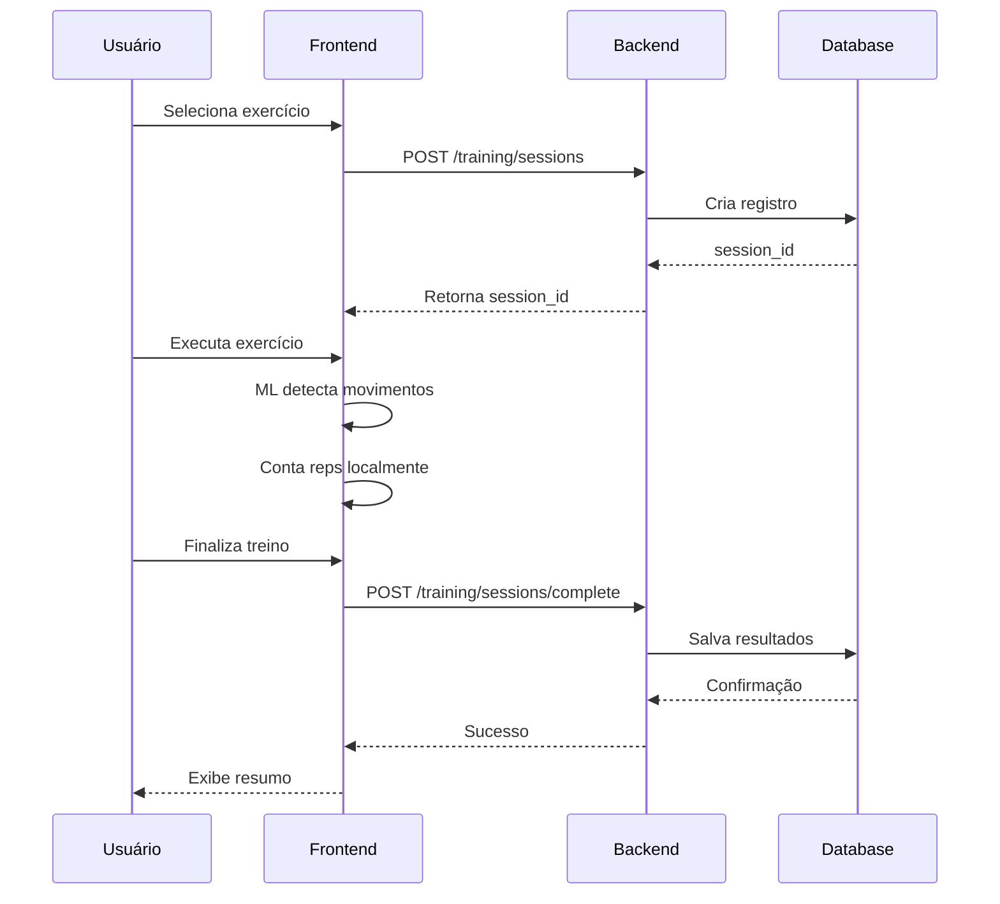

# 🏋️ Elarin MVP - Personal Training com IA

> Plataforma de treino personalizado com detecção de movimentos em tempo real usando Machine Learning

[](https://kit.svelte.dev/)
[](https://nestjs.com/)
[](https://www.tensorflow.org/js)
[](https://supabase.com/)

---

## 📋 Índice

- [Visão Geral](#-visão-geral)
- [Stack Tecnológica](#-stack-tecnológica)
- [Funcionalidades](#-funcionalidades)
- [Estrutura do Projeto](#-estrutura-do-projeto)
- [Instalação e Uso](#-instalação-e-uso)
- [Integração Backend](#-integração-backend)
- [Branches](#-branches)
- [Documentação](#-documentação)

---

## 🎯 Visão Geral

Elarin é uma plataforma de treino personalizado que utiliza **Inteligência Artificial** para detectar e analisar movimentos do usuário em tempo real através da câmera, oferecendo feedback instantâneo sobre a execução dos exercícios.

### ✨ Diferenciais

- 🎥 **Detecção em Tempo Real** - TensorFlow.js + MediaPipe
- 🤖 **Análise de Movimentos** - Feedback instantâneo sobre execução
- 📊 **Histórico de Treinos** - Acompanhamento de progresso
- 🔐 **Autenticação Segura** - JWT via Supabase Auth
- 📱 **Interface Responsiva** - Design moderno e intuitivo

---

## 🛠️ Stack Tecnológica

### Frontend
- **SvelteKit** - Framework web moderno e reativo
- **TypeScript** - Tipagem estática
- **TailwindCSS** - Estilização
- **TensorFlow.js** - Machine Learning no navegador
- **MediaPipe** - Detecção de poses

### Backend
- **NestJS** - Framework Node.js robusto
- **Fastify** - Servidor HTTP de alta performance
- **Supabase** - Database PostgreSQL + Auth
- **JWT** - Autenticação via tokens

### DevOps
- **Git** - Controle de versão
- **npm** - Gerenciamento de pacotes

---

## ✅ Funcionalidades

### 🔐 Autenticação
- [x] Registro de usuários
- [x] Login/Logout
- [x] Gerenciamento de sessões JWT
- [x] Proteção de rotas

### 🏋️ Exercícios
- [x] Carregamento dinâmico de exercícios do backend
- [x] Filtro por tipo e dificuldade
- [x] Badges para exercícios disponíveis/em breve
- [x] Suporte atual: **Agachamento (Squat)** e **Flexão (Push-up)**

### 💪 Sistema de Treino
- [x] Criação de sessões de treino
- [x] Detecção de movimentos em tempo real
- [x] Contador de repetições automático
- [x] Indicador de fase do exercício
- [x] Controles de câmera (pausar/retomar)
- [x] Salvamento automático no backend
- [x] Cálculo de confiança média (accuracy)

### 📊 Histórico e Análise
- [x] Histórico de treinos salvos
- [x] Detalhes de sessões individuais
- [x] Métricas: reps, sets, duração, confiança
- [ ] Gráficos de progresso (em desenvolvimento)
- [ ] Análise de performance (em desenvolvimento)

---

## 📂 Estrutura do Projeto

```
elarin-mvp-full/
├── apps/
│   └── web/                          # Frontend SvelteKit
│       ├── src/
│       │   ├── lib/
│       │   │   ├── api/              # Clientes API
│       │   │   │   ├── rest.client.ts      # Cliente HTTP base
│       │   │   │   ├── training.api.ts     # API de treino
│       │   │   │   └── exercises.api.ts    # API de exercícios ⭐ NOVO
│       │   │   ├── stores/           # State management
│       │   │   │   ├── auth.store.ts
│       │   │   │   └── integrated-train.store.ts
│       │   │   └── ml/               # Modelos ML
│       │   └── routes/               # Páginas
│       │       ├── login/            # Login
│       │       ├── register/         # Registro
│       │       ├── exercises/        # Grid de exercícios
│       │       └── train/            # Tela de treino
│       └── static/
│           └── models_tfjs/          # Modelos TensorFlow.js
│               ├── squat/
│               └── push_up/
├── BACKEND_INTEGRATION.md            # Documentação de integração ⭐ NOVO
├── ENDPOINTS_CORRETOS.md             # Mapeamento de endpoints ⭐ NOVO
├── seed_exercises.sql                # Script de seed ⭐ NOVO
└── README.md                         # Este arquivo

Backend (repositório separado):
elarin-backend-api-main/
├── src/
│   ├── auth/                         # Módulo de autenticação
│   ├── exercises/                    # Módulo de exercícios
│   └── training/                     # Módulo de treino
└── README.md
```

---

## 🚀 Instalação e Uso

### Pré-requisitos

- **Node.js** 18+ e npm
- **Git**
- Conta no **Supabase** (para database)

### 1️⃣ Clonar o Repositório

```bash
git clone <url-do-repositorio>
cd elarin-mvp-full
```

### 2️⃣ Instalar Dependências

```bash
npm install
```

### 3️⃣ Configurar Variáveis de Ambiente

Copie o arquivo `.env.example` para `.env`:

```bash
cd apps/web
cp .env.example .env
```

Edite `.env` com suas credenciais do Supabase:

```env
PUBLIC_SUPABASE_URL=sua-url-aqui
PUBLIC_SUPABASE_ANON_KEY=sua-chave-aqui
```

### 4️⃣ Iniciar Backend

Em outro terminal:

```bash
cd ../../../elarin-backend-api-main
npm install
npm run dev
```

✅ Backend rodando em: `http://localhost:3001`
✅ Swagger docs: `http://localhost:3001/docs`

### 5️⃣ Iniciar Frontend

```bash
cd elarin-mvp-full/apps/web
npm run dev
```

✅ Frontend rodando em: `http://localhost:5173`

### 6️⃣ Configurar Database

Execute o script de seed no Supabase SQL Editor:

```sql
-- Ver arquivo: seed_exercises.sql
INSERT INTO public.exercises (type, name_en, name_pt, category, difficulty, ml_model_path, is_active)
VALUES
  ('squat', 'Squat', 'Agachamento', 'lower_body', 1, '/models_tfjs/squat/', TRUE),
  ('push_up', 'Push-up', 'Flexão', 'upper_body', 2, '/models_tfjs/push_up/', TRUE);
```

---

## 🔌 Integração Backend

### Endpoints Disponíveis

#### 🔐 **Autenticação** (`/auth`)

| Método | Endpoint | Descrição |
|--------|----------|-----------|
| POST | `/auth/register` | Registrar novo usuário |
| POST | `/auth/login` | Fazer login |
| POST | `/auth/logout` | Fazer logout |

#### 🏋️ **Exercícios** (`/exercises`)

| Método | Endpoint | Descrição |
|--------|----------|-----------|
| GET | `/exercises` | Listar todos exercícios |
| GET | `/exercises/:type` | Buscar exercício por tipo |

#### 💪 **Treino** (`/training`)

| Método | Endpoint | Descrição |
|--------|----------|-----------|
| POST | `/training/sessions` | Criar sessão de treino |
| POST | `/training/sessions/complete` | Finalizar sessão |
| GET | `/training/history` | Buscar histórico |
| GET | `/training/sessions/:id` | Detalhes da sessão |

### Fluxo de Treino



**Documentação completa:** [BACKEND_INTEGRATION.md](./BACKEND_INTEGRATION.md)

---

## 🌿 Branches

### `main`
Branch principal de produção (estável)

### `feat/train-camera-controls-and-phase-indicator` ⭐ ATUAL
Última atualização com:
- ✅ Integração 100% com backend NestJS
- ✅ Sistema de autenticação completo
- ✅ Carregamento dinâmico de exercícios
- ✅ Controles de câmera e indicador de fase
- ✅ Salvamento de treinos no backend

**Commits recentes:**
- `53dd0ea` - feat: integrate backend API with frontend authentication and training
- `8b265f5` - feat: implement camera controls and phase indicator for training module
- `e181c47` - feat: Implementar detecção de agachamento com ML e controles de câmera

---

## 📚 Documentação

### Documentos Disponíveis

- **[BACKEND_INTEGRATION.md](./BACKEND_INTEGRATION.md)** - Guia completo de integração backend/frontend
- **[ENDPOINTS_CORRETOS.md](./ENDPOINTS_CORRETOS.md)** - Mapeamento de todos os endpoints da API
- **[seed_exercises.sql](./seed_exercises.sql)** - Script SQL para popular exercícios

### Recursos Externos

- [Documentação SvelteKit](https://kit.svelte.dev/docs)
- [Documentação NestJS](https://docs.nestjs.com/)
- [TensorFlow.js Guide](https://www.tensorflow.org/js/guide)
- [MediaPipe Pose](https://google.github.io/mediapipe/solutions/pose.html)
- [Supabase Docs](https://supabase.com/docs)

---

## 🧪 Como Testar

### Teste Completo do Fluxo

1. **Registro**
   - Acesse `http://localhost:5173/register`
   - Registre um novo usuário
   - Verifique console: `✅ Token saved`

2. **Login**
   - Acesse `http://localhost:5173/login`
   - Faça login com suas credenciais
   - Verifique console: `✅ Login successful`

3. **Exercícios**
   - Acesse `http://localhost:5173/exercises`
   - Veja os exercícios carregados do backend
   - Clique em "Agachamento" ou "Flexão"

4. **Treino**
   - Permita acesso à câmera
   - Clique "Iniciar Treino"
   - Execute alguns movimentos
   - Veja o contador de reps aumentar
   - Clique "Finalizar Treino"
   - Verifique console: `✅ Treino finalizado e enviado ao backend!`

### Verificar Network Requests

Abra DevTools → Network → Filtro: `localhost:3001`

**Requests esperados:**
- `POST /auth/login` → 200 OK
- `GET /exercises` → 200 OK
- `POST /training/sessions` → 201 Created
- `POST /training/sessions/complete` → 200 OK

---

## 🐛 Troubleshooting

### Erro: "Failed to fetch"
**Causa:** Backend não está rodando

**Solução:**
```bash
cd elarin-backend-api-main
npm run dev
```

### Erro: "Unauthorized" (401)
**Causa:** Token inválido ou expirado

**Solução:**
1. Faça logout
2. Faça login novamente
3. Token será renovado

### ML Detector não inicia
**Causa:** Scripts externos não carregados

**Solução:**
1. Verifique console do navegador
2. Recarregue a página (F5)
3. Limpe cache se necessário

---

## 🤝 Contribuindo

Contribuições são bem-vindas! Por favor:

1. Fork o projeto
2. Crie uma branch para sua feature (`git checkout -b feat/nova-feature`)
3. Commit suas mudanças (`git commit -m 'feat: adiciona nova feature'`)
4. Push para a branch (`git push origin feat/nova-feature`)
5. Abra um Pull Request

---

## 📄 Licença

Este projeto é privado e proprietário.

---

## 👥 Autores

Desenvolvido por **Guilherme** com assistência do Claude Code Assistant.

---

## 📊 Status do Projeto

**Versão:** 1.0.0-beta
**Status:** Em desenvolvimento ativo 🚧
**Última atualização:** 17 de Outubro de 2025

### Roadmap

- [x] Sistema de autenticação
- [x] Detecção de agachamento
- [x] Detecção de flexão
- [x] Integração com backend
- [x] Salvamento de treinos
- [ ] Página de histórico
- [ ] Gráficos de progresso
- [ ] Mais exercícios com ML
- [ ] Sistema de gamificação
- [ ] Modo multiplayer/competição
- [ ] Deploy em produção

---

**🏋️ Bora treinar com IA! 💪**
