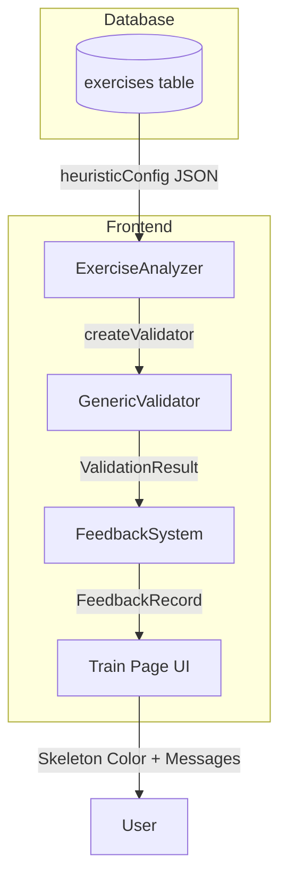

# Sistema Genérico de Heurísticas - Documentação Completa

## Visão Geral

O **GenericValidator** é um sistema de validação de exercícios baseado em configuração JSON. Ele substitui validadores específicos (como `SquatValidator`, `PlankValidator`) por um único validador genérico que interpreta regras definidas no banco de dados.

### Vantagens
- ✅ **Zero código** para adicionar novos exercícios
- ✅ **Configuração dinâmica** via banco de dados
- ✅ **Manutenção simplificada** (um único ponto de código)
- ✅ **Flexibilidade** para ajustar parâmetros sem deploy

---

## Arquitetura



---

## Referência Completa de Propriedades

### Estrutura Raiz do `heuristicConfig`

```json
{
  "mode": "reps",
  "states": [...],
  "initialState": "UP",
  "repRule": {...},
  "primaryAngle": {...},
  "checks": [...],
  "calibration": {...},
  "minConfidence": 0.7,
  "feedbackCooldownMs": 350
}
```

| Propriedade | Tipo | Obrigatório | Descrição |
|-------------|------|-------------|-----------|
| `mode` | `"reps"` \| `"hold"` \| `"hybrid"` | Sim | Modo do exercício (ver seção Modos) |
| `states` | `StateDefinition[]` | Para `reps` | Lista de estados da máquina de estados |
| `initialState` | `string` | Para `reps` | Nome do estado inicial (ex: "UP") |
| `repRule` | `RepRule` | Para `reps` | Regra de contagem de repetições |
| `primaryAngle` | `PrimaryAngle` | Não | Ângulo principal para tracking visual |
| `checks` | `CheckDefinition[]` | Sim | Lista de validações de postura |
| `calibration` | `CalibrationConfig` | Não | Calibração opcional (ex.: usar cm com altura do usuário) |
| `minConfidence` | `number` | Não | Confiança mínima dos landmarks (0.0-1.0). Default: 0.7 |
| `feedbackCooldownMs` | `number` | Não | Cooldown global entre alertas de áudio em ms. Default: 350 |

---

### Modos de Exercício (`mode`)

| Valor | Descrição | Exemplo |
|-------|-----------|---------|
| `"reps"` | Conta repetições usando máquina de estados | Agachamento, Flexão, Afundo |
| `"hold"` | Valida posição estática continuamente | Prancha, Parede, Isometria |
| `"hybrid"` | Combina estados com timer | Agachamento isométrico |

---

### Definição de Estado (`StateDefinition`)

```json
{
  "name": "DOWN",
  "minFrames": 3,
  "entryConditions": [...]
}
```

| Propriedade | Tipo | Obrigatório | Descrição |
|-------------|------|-------------|-----------|
| `name` | `string` | Sim | Identificador único do estado (ex: "UP", "DOWN") |
| `minFrames` | `number` | Não | Frames mínimos que deve permanecer antes de sair. Default: 1 |
| `entryConditions` | `Condition[]` | Sim | Condições para entrar neste estado (todas devem ser verdadeiras) |

---

### Regra de Repetição (`RepRule`)

```json
{
  "trigger": "on_complete",
  "sequence": ["UP", "DOWN", "UP"]
}
```

| Propriedade | Tipo | Obrigatório | Descrição |
|-------------|------|-------------|-----------|
| `trigger` | `"on_complete"` \| `"on_transition"` | Sim | Quando contar a rep |
| `sequence` | `string[]` | Sim | Sequência de estados que completa uma rep |

**Valores de `trigger`:**
- `"on_complete"` - Conta quando toda a sequência é completada
- `"on_transition"` - Conta a cada transição de estado

---

### Ângulo Principal (`primaryAngle`)

```json
{
  "name": "left_knee",
  "landmarks": [23, 25, 27],
  "smoothingFrames": 3
}
```

| Propriedade | Tipo | Obrigatório | Descrição |
|-------------|------|-------------|-----------|
| `name` | `string` | Sim | Nome identificador do ângulo |
| `landmarks` | `[number, number, number]` | Sim | 3 landmarks que formam o ângulo |
| `smoothingFrames` | `number` | Não | Frames para suavização. Default: 1 |

---

### Definição de Check (`CheckDefinition`)

```json
{
  "id": "lateral_inclination",
  "name": "Inclinação Lateral",
  "severity": "medium",
  "cooldownMs": 500,
  "activeInStates": ["DOWN"],
  "messages": {
    "fail": "Mantenha os ombros nivelados",
    "pass": "Tronco estável"
  },
  "condition": {...}
}
```

| Propriedade | Tipo | Obrigatório | Descrição |
|-------------|------|-------------|-----------|
| `id` | `string` | Sim | Identificador único do check |
| `name` | `string` | Sim | Nome legível para exibição na UI |
| `severity` | `"low"` \| `"medium"` \| `"high"` \| `"critical"` | Sim | Gravidade do erro |
| `cooldownMs` | `number` | Não | Cooldown específico deste check. Default: usa global |
| `activeInStates` | `string[]` | Não | Só ativa nesses estados. Default: sempre ativo |
| `messages.fail` | `string` | Sim | Mensagem exibida quando a condição falha |
| `messages.pass` | `string` | Sim | Mensagem quando passa (usada internamente) |
| `condition` | `Condition` | Sim | A condição a ser avaliada |

**Valores de `severity`:**
| Valor | Cor | Uso |
|-------|-----|-----|
| `"low"` | Amarelo | Avisos menores |
| `"medium"` | Laranja | Correções importantes |
| `"high"` | Vermelho | Erros que afetam a execução |
| `"critical"` | Vermelho escuro | Risco de lesão |

---

## Tipos de Condição

### 1. Ângulo (`angle`)

Calcula o ângulo formado por 3 landmarks onde o segundo ponto é o vértice.

```json
{
  "type": "angle",
  "landmarks": [23, 25, 27],
  "operator": ">=",
  "value": 160
}
```

| Propriedade | Tipo | Obrigatório | Descrição |
|-------------|------|-------------|-----------|
| `type` | `"angle"` | Sim | Identifica o tipo de condição |
| `landmarks` | `[number, number, number]` | Sim | 3 pontos [A, B, C] onde B é o vértice |
| `operator` | `"<"` \| `">"` \| `"<="` \| `">="` \| `"between"` | Sim | Operador de comparação |
| `value` | `number` \| `[number, number]` | Sim | Valor em graus. Array para `between` |

**Exemplo Visual:**
```
     Ponto A (23)
        \
         \  ← Ângulo medido aqui
          \
        Ponto B (25) ← Vértice
          /
         /
        /
    Ponto C (27)
```

---

### 2. Distância (`distance`)

Calcula a distância normalizada (0.0 a 1.0) entre 2 landmarks.

```json
{
  "type": "distance",
  "landmarks": [27, 28],
  "operator": "between",
  "value": [0.1, 0.4],
  "unit": "norm"
}
```

| Propriedade | Tipo | Obrigatório | Descrição |
|-------------|------|-------------|-----------|
| `type` | `"distance"` | Sim | Identifica o tipo de condição |
| `landmarks` | `[number, number]` | Sim | 2 pontos para medir distância |
| `operator` | `"<"` \| `">"` \| `"<="` \| `">="` \| `"between"` | Sim | Operador de comparação |
| `value` | `number` \| `[number, number]` | Sim | Distância normalizada (0.0-1.0) |
| `unit` | `"norm"` \| `"cm"` | Não | Unidade usada na comparação. Default: `"norm"` |

**Nota:** A distância é relativa ao tamanho da imagem.
- `0.1` = 10% da largura/altura da tela
- `0.5` = 50% da largura/altura da tela

**Usar centímetros (`unit: "cm"`):**
- Requer **calibração** para converter cm → unidades normalizadas.
- Sem calibração, a comparação em cm **não é confiável**.
- Se `heightCm` não for informado, o app tenta usar a altura do usuário do cadastro (quando disponível).

---

### 3. Alinhamento (`alignment`)

Verifica se 2 landmarks estão alinhados em um eixo.

```json
{
  "type": "alignment",
  "axis": "horizontal",
  "landmarks": [11, 12],
  "tolerance": 0.05
}
```

| Propriedade | Tipo | Obrigatório | Descrição |
|-------------|------|-------------|-----------|
| `type` | `"alignment"` | Sim | Identifica o tipo de condição |
| `axis` | `"horizontal"` \| `"vertical"` | Sim | Eixo de alinhamento |
| `landmarks` | `[number, number]` | Sim | 2 pontos que devem estar alinhados |
| `tolerance` | `number` | Sim | Tolerância (0.0-1.0) |

**Comportamento por Eixo:**
| Eixo | Verifica | Fórmula | Uso Comum |
|------|----------|---------|-----------|
| `horizontal` | Mesma altura Y | `abs(y1 - y2) < tolerance` | Ombros nivelados |
| `vertical` | Mesma posição X | `abs(x1 - x2) < tolerance` | Coluna reta, joelho sobre tornozelo |

---

### 4. Simetria (`symmetry`)

Compara valores calculados entre lado esquerdo e direito do corpo.

```json
{
  "type": "symmetry",
  "leftLandmarks": [23, 25, 27],
  "rightLandmarks": [24, 26, 28],
  "maxDifference": 10
}
```

| Propriedade | Tipo | Obrigatório | Descrição |
|-------------|------|-------------|-----------|
| `type` | `"symmetry"` | Sim | Identifica o tipo de condição |
| `leftLandmarks` | `[n,n,n]` ou `[n,n]` | Sim | Landmarks do lado esquerdo |
| `rightLandmarks` | `[n,n,n]` ou `[n,n]` | Sim | Landmarks do lado direito |
| `maxDifference` | `number` | Sim | Diferença máxima permitida |

**Comportamento:**
- Se 3 landmarks → Calcula ângulo de cada lado e compara
- Se 2 landmarks → Calcula distância de cada lado e compara

---

### Operadores de Comparação (`operator`)

| Operador | Significado | Exemplo |
|----------|-------------|---------|
| `"<"` | Menor que | Ângulo < 90° |
| `">"` | Maior que | Ângulo > 45° |
| `"<="` | Menor ou igual | Ângulo <= 120° |
| `">="` | Maior ou igual | Ângulo >= 160° |
| `"between"` | Entre dois valores | Distância entre 0.1 e 0.4 |

---

## Referência de Landmarks (MediaPipe Pose)

```
        0 (Nariz)
       /|\
      / | \
     1  |  2  (Olhos internos)
     3  |  4  (Olhos)
     5  |  6  (Olhos externos)
     7  |  8  (Orelhas)
        |
       9|10  (Boca)
        |
    11----12  (Ombros)
     |    |
    13   14  (Cotovelos)
     |    |
    15   16  (Pulsos)
    17   18  (Mindinho)
    19   20  (Indicador)
    21   22  (Polegar)
        |
    23----24  (Quadris)
     |    |
    25   26  (Joelhos)
     |    |
    27   28  (Tornozelos)
     |    |
    29   30  (Calcanhares)
     |    |
    31   32  (Ponta dos Pés)
```

### Tabela Completa de Landmarks

| ID | Nome | Lado | Uso Comum |
|----|------|------|-----------|
| 0 | Nariz | Centro | Referência central |
| 1, 2 | Olhos internos | E/D | - |
| 3, 4 | Olhos | E/D | - |
| 5, 6 | Olhos externos | E/D | - |
| 7, 8 | Orelhas | E/D | Alinhamento cabeça |
| 9, 10 | Boca | E/D | - |
| **11, 12** | **Ombros** | **E/D** | **Inclinação, postura** |
| 13, 14 | Cotovelos | E/D | Ângulo braço |
| 15, 16 | Pulsos | E/D | Posição mãos |
| 17, 18 | Mindinho | E/D | - |
| 19, 20 | Indicador | E/D | - |
| 21, 22 | Polegar | E/D | - |
| **23, 24** | **Quadris** | **E/D** | **Ângulo tronco, simetria** |
| **25, 26** | **Joelhos** | **E/D** | **Ângulo flexão, valgo** |
| **27, 28** | **Tornozelos** | **E/D** | **Largura pés, base** |
| 29, 30 | Calcanhares | E/D | Base |
| 31, 32 | Ponta pés | E/D | Base |

---

## Exemplo Completo: Agachamento

```json
{
  "mode": "reps",
  "states": [
    {
      "name": "UP",
      "minFrames": 3,
      "entryConditions": [
        {"type": "angle", "landmarks": [23, 25, 27], "operator": ">=", "value": 160}
      ]
    },
    {
      "name": "DOWN",
      "minFrames": 3,
      "entryConditions": [
        {"type": "angle", "landmarks": [23, 25, 27], "operator": "<=", "value": 120}
      ]
    }
  ],
  "checks": [
    {
      "id": "lateral_inclination",
      "name": "Inclinação Lateral",
      "severity": "medium",
      "cooldownMs": 500,
      "messages": {"fail": "Mantenha os ombros nivelados", "pass": "Tronco estável"},
      "condition": {"type": "alignment", "axis": "horizontal", "landmarks": [11, 12], "tolerance": 0.05}
    },
    {
      "id": "foot_width",
      "name": "Largura dos Pés",
      "severity": "low",
      "cooldownMs": 500,
      "messages": {"fail": "Ajuste a largura dos pés", "pass": "Pés bem posicionados"},
      "condition": {"type": "distance", "landmarks": [27, 28], "operator": "between", "value": [0.1, 0.4]}
    }
  ],
  "repRule": {"trigger": "on_complete", "sequence": ["UP", "DOWN", "UP"]},
  "initialState": "UP",
  "primaryAngle": {"name": "left_knee", "landmarks": [23, 25, 27], "smoothingFrames": 3},
  "calibration": {"mode": "height", "heightCm": 175, "minHeightRatio": 0.6, "smoothing": 0.2},
  "minConfidence": 0.7,
  "feedbackCooldownMs": 350
}
```

---

## Calibração (`calibration`)

Permite usar **cm** em checks de distância. O sistema calcula a escala (cm por unidade normalizada)
usando a **altura do usuário**.

```json
{
  "calibration": {
    "mode": "height",
    "heightCm": 175,
    "minHeightRatio": 0.6,
    "smoothing": 0.2
  }
}
```

| Propriedade | Tipo | Obrigatório | Descrição |
|-------------|------|-------------|-----------|
| `mode` | `"height"` | Não | Método de calibração (por altura) |
| `heightCm` | `number` | Não | Altura do usuário (em cm) |
| `minHeightRatio` | `number` | Não | Altura mínima visível (0.0-1.0) para calibrar. Default: 0.6 |
| `smoothing` | `number` | Não | Suavização (0-1) da escala. Default: 0.2 |

**Boas práticas:**
- Calibrar com o corpo inteiro visível em pé por alguns segundos.
- Se a pessoa se aproximar/afastar muito, recalibrar.

---

## Notas de Implementação (Atual)
- `unit: "cm"` depende da escala calibrada por altura; sem escala válida, a condição falha.
- `calibration.mode: "height"` usa a altura do usuário e precisa de corpo inteiro visível no início.

---

## Exemplo: Prancha (Exercício de Hold)

```json
{
  "mode": "hold",
  "checks": [
    {
      "id": "hip_alignment",
      "name": "Alinhamento do Quadril",
      "severity": "high",
      "cooldownMs": 1000,
      "messages": {"fail": "Mantenha o quadril alinhado", "pass": "Quadril em posição"},
      "condition": {"type": "alignment", "axis": "horizontal", "landmarks": [11, 23], "tolerance": 0.08}
    },
    {
      "id": "back_straight",
      "name": "Costas Retas",
      "severity": "high",
      "cooldownMs": 1000,
      "messages": {"fail": "Mantenha as costas retas", "pass": "Costas alinhadas"},
      "condition": {"type": "angle", "landmarks": [11, 23, 27], "operator": ">=", "value": 160}
    }
  ],
  "minConfidence": 0.7,
  "feedbackCooldownMs": 500
}
```

---

## Como Adicionar um Novo Exercício

### Passo 1: Identificar o Modo
- Conta repetições? → `"reps"`
- Mantém posição? → `"hold"`
- Ambos? → `"hybrid"`

### Passo 2: Mapear Landmarks
Use a tabela de referência para identificar quais pontos do corpo são relevantes.

### Passo 3: Definir Estados (se `reps`)
- Quais são as posições chave do movimento?
- Qual ângulo define cada posição?

### Passo 4: Definir Checks
- O que pode dar errado?
- Qual tipo de condição valida isso?

### Passo 5: Inserir no Banco
Cole o JSON no campo `config.heuristicConfig`.

### Passo 6: Testar
- Skeleton verde quando correto?
- Skeleton vermelho quando errado?
- Mensagens estáveis?

---

## Troubleshooting

| Problema | Causa Provável | Solução |
|----------|----------------|---------|
| Skeleton sempre azul | JSON malformado ou checks vazio | Validar JSON no jsonlint.com |
| Mensagens piscando | Tolerância muito baixa | Aumentar tolerance/maxDifference |
| Rep não conta | Sequência incorreta | Verificar repRule.sequence |
| Check nunca dispara | Threshold permissivo demais | Diminuir tolerance ou ajustar value |
| Check sempre dispara | Threshold muito restritivo | Aumentar tolerance ou ajustar value |

---

## Arquivos Relevantes

| Arquivo | Descrição |
|---------|-----------|
| `validators/GenericValidator.ts` | Implementação principal |
| `types/validator-config.types.ts` | Definições TypeScript |
| `validators/BaseValidator.ts` | Utilitários (ângulos, distâncias) |
| `validators/index.ts` | Factory |
| `core/FeedbackSystem.ts` | Processa resultados |
| `routes/(app)/train/+page.svelte` | UI |
